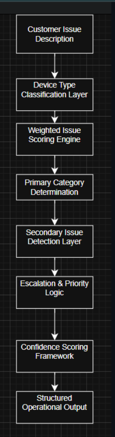

# PARAGON GEEKS — Operational AI Intake Decision System  
Hybrid Explainable AI Framework for Repair Operations

## Table of Contents
- [Executive Overview](#executive-overview)
- [System Architecture](#system-architecture)
- [System Architecture & Design Principles](#system-architecture--design-principles)
- [Business Context](#business-context)
- [Repair Categories Modeled](#repair-categories-modeled)
- [Operational Execution Simulation](#operational-execution-simulation)
- [Confidence & Escalation Modeling](#confidence--escalation-modeling)
- [Operational Impact & Deployment Potential](#operational-impact--deployment-potential)
- [Business Intelligence & Academic Alignment](#business-intelligence--academic-alignment)
- [Technical Skills Demonstrated](#technical-skills-demonstrated)
- [How to Run](#how-to-run)
- [Author](#author)

---

## Executive Overview

This project models a structured, explainable AI decision system designed to standardize repair intake triage within a real-world electronics repair business environment (Paragon Geeks).

Rather than relying on black-box machine learning alone, the system implements a transparent **weighted rule-based classification engine** that mirrors how experienced technicians evaluate devices at intake.

The framework converts unstructured customer issue descriptions into structured, auditable operational outputs — including:
- Primary repair category
- Priority level
- Estimated service time
- Secondary risk flags (multi-issue detection)
- Confidence score

This project demonstrates applied AI systems design grounded in **Management Information Systems, Business Analytics, and operational process engineering**.

---

## System Architecture



*Figure: Layered AI decision pipeline from customer issue description → structured operational output.*

---

## System Architecture & Design Principles

The AI Intake Engine is built on modular decision layers:

- Device type inference (phone / tablet / console / computer)
- Weighted keyword scoring engine (category scoring)
- Primary category determination
- Secondary issue detection (multi-label flagging)
- Escalation & priority logic
- Confidence scoring framework
- Structured time-estimation mapping

Design priorities:

- Deterministic & explainable outputs  
- Auditability of decision paths  
- Operational consistency  
- Extensibility for ML enhancement  
- Business-rule traceability  

This architecture reflects enterprise-ready decision automation systems where **explainability and governance** are critical.

---

## Business Context

Designed around real intake patterns from an electronics repair environment.

Instead of generic keyword matching, this system implements:

- Weighted category scoring  
- Multi-issue detection  
- Escalated priority logic  
- Secondary repair flagging  
- Confidence scoring model  
- Device-type overrides (e.g., console HDMI logic)  

This mirrors how experienced technicians triage devices in real life.

---

## Repair Categories Modeled

- Screen Repair  
- Battery Replacement  
- Charging Port Repair  
- Water Damage Treatment  
- Camera Repair  
- Software / Data Issue  
- Board-Level / No Power  
- Console / HDMI Repair  
- Diagnostic / General Check  

---

## Operational Execution Simulation

This project includes **two execution modes**:

### 1) Auto Demo Mode (Batch Test Cases)

Runs a prebuilt set of realistic intake scenarios to validate category coverage and logic behavior.


*Figure: Auto demo run showing multiple devices/issues, predicted category, confidence, priority, estimated time, and category distribution.*

### 2) Live Interactive Triage Mode (Manual Input)

Allows a user to enter a device + issue and receive a structured triage response.


*Figure: Live triage execution demonstrating multi-issue detection and structured operational output.*

---

## Confidence & Escalation Modeling

The system applies operational rules that mimic real repair workflows:

- **Priority escalation** for high-risk scenarios (water damage, no power, board-level)
- **Secondary flags** when multiple repair signals are detected (e.g., cracked screen + not charging)
- **Confidence scoring** based on strength of category match and keyword density
- **Time estimation mapping** that aligns with real shop expectations

Outputs remain deterministic and explainable — supporting governance and auditability.

---

## Operational Impact & Deployment Potential

This system demonstrates how repair intake can be standardized into a repeatable process:

- Reduces human inconsistency at intake
- Improves triage accuracy and routing
- Flags high-risk jobs early (water/board-level)
- Creates structured intake records for analytics and reporting

Future extensions could include:

- Web-based intake portal (Streamlit / Flask)
- CRM / ticketing integration
- POS intake logging
- Repair analytics dashboards
- ML enhancement layer trained on labeled intake outcomes

---

## Business Intelligence & Academic Alignment

This project aligns directly with competencies developed through:

- **B.S. in Management Information Systems & Business Analytics**
- **M.S. in Data Analytics (AI & Machine Learning focus)**

SAS-aligned analytics competencies reinforced by certifications:
- Statistics & Data Mining for Business Intelligence  
- Predictive Analytics Management  
- Enterprise Performance Management  
- Applied Data Analytics  

Core competencies demonstrated:

- Decision system engineering  
- Rule-based classification design  
- Operational process automation  
- Explainable AI architecture  
- Domain-driven feature engineering  
- Governance-first system design  

---

## Technical Skills Demonstrated

- Python rule-based classification systems  
- Weighted scoring algorithms  
- Multi-label issue detection  
- Escalation & priority logic  
- Confidence scoring frameworks  
- Structured operational output design  
- Domain-specific keyword engineering  
- CLI interactive workflow simulation  

---

## How to Run

1. Clone the repository:
```bash
git clone https://github.com/KevinTurner11/paragon-geeks-ai-repair-assistant.git
cd paragon-geeks-ai-repair-assistant
```
2. Navigate into the project folder:

   ```
   cd paragon-geeks-ai-repair-assistant
   ```

3. Open the notebook using Jupyter Notebook or VS Code.

4. Run all cells.

5. Execute:

   ```
   run_demo_cases()
   run_interactive_mode()
   ```

Interactive mode allows custom device triage testing.

---

## Author

Kevin Turner  
Management Information Systems & Data Analytics  
SAS Certified | Business Intelligence | AI-Focused Portfolio Development


