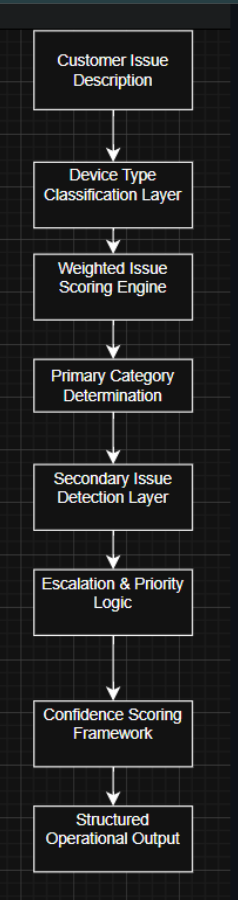
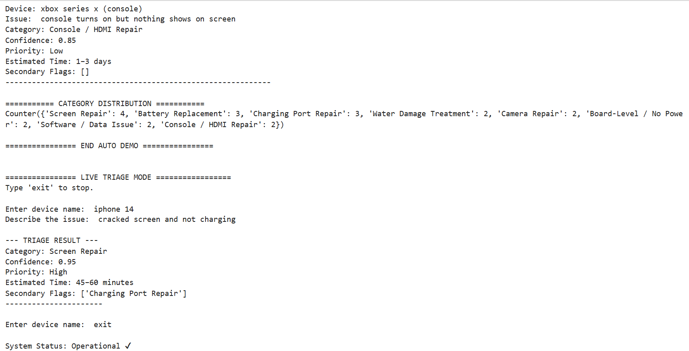

# Paragon Geeks — Operational Intake Decision Automation System

Rule-Based Triage Engine for Standardizing Repair Intake & Routing

---

## 🚀 Business Impact Snapshot

- Converted **unstructured customer issue descriptions into structured operational outputs**  
- Standardized repair intake across categories, priority, and routing logic  
- Implemented **weighted scoring engine for deterministic classification**  
- Enabled **multi-issue detection (primary + secondary repair flags)**  
- Designed **confidence scoring framework for decision transparency**  
- Simulated real-world intake workflow via **interactive triage system**  

---

## 📑 Table of Contents

- [Executive Overview](#executive-overview)
- [System Architecture](#system-architecture)
- [Business Context](#business-context)
- [Core Decision Framework](#core-decision-framework)
- [Repair Categories Modeled](#repair-categories-modeled)
- [Operational Execution Simulation](#operational-execution-simulation)
- [Confidence & Escalation Modeling](#confidence--escalation-modeling)
- [Operational Impact & Deployment Potential](#operational-impact--deployment-potential)
- [Technical Skills Demonstrated](#technical-skills-demonstrated)
- [How to Run](#how-to-run)

---

## Executive Overview

This project implements a **rule-based operational intake automation system** designed to standardize repair triage in a production electronics repair environment.

The system converts **unstructured customer issue descriptions** into structured, explainable outputs that support:

- Repair routing  
- Priority assignment  
- Escalation logic  
- Time estimation  
- Downstream analytics  

Structured outputs include:

- Primary repair category  
- Priority level  
- Estimated service time  
- Secondary issue flags  
- Confidence score  

Rather than relying on black-box machine learning, the system uses a **transparent weighted scoring framework**, mirroring how experienced technicians evaluate devices at intake.

---

## System Architecture



*Layered decision pipeline from customer issue → structured operational output.*

### Decision Layers

- Device type classification (phone / tablet / console / computer)  
- Weighted issue scoring engine  
- Primary category determination  
- Secondary issue detection (multi-label)  
- Escalation & priority logic  
- Confidence scoring framework  
- Time estimation mapping  

### Design Principles

- Deterministic and explainable outputs  
- Full decision traceability  
- Operational consistency  
- Extensible architecture (ML-ready)  
- Business-rule alignment  

---

## Business Context

Designed using real-world repair intake patterns.

This system goes beyond simple keyword matching by implementing:

- Weighted category scoring  
- Multi-issue detection  
- Priority escalation logic  
- Secondary repair flagging  
- Confidence scoring  
- Device-specific overrides  

This replicates how experienced technicians perform intake triage in practice.

---

## Core Decision Framework

The system processes input through a structured pipeline:

1. **Customer Issue Description**  
2. **Device Type Classification**  
3. **Weighted Keyword Scoring Engine**  
4. **Primary Category Determination**  
5. **Secondary Issue Detection**  
6. **Priority & Escalation Logic**  
7. **Confidence Scoring**  
8. **Structured Operational Output**

This ensures outputs are:

- Consistent  
- Explainable  
- Operationally usable  

---

## Repair Categories Modeled

- Screen Repair  
- Battery Replacement  
- Charging Port Repair  
- Water Damage Treatment  
- Camera Repair  
- Software / Data Issue  
- Board-Level / No Power  
- Console / HDMI Repair  
- Diagnostic / General Check  

---

## Operational Execution Simulation

### 1) Auto Demo Mode (Batch Testing)

Runs prebuilt scenarios to validate system behavior.


Outputs include:
- Category predictions  
- Confidence scores  
- Priority levels  
- Time estimates  
- Category distribution summary  

---

### 2) Live Interactive Triage Mode

Allows real-time user input:



Example output:

- Category: Screen Repair  
- Confidence: 0.95  
- Priority: High  
- Estimated Time: 45–60 minutes  
- Secondary Flags: Charging Port Repair  

---

## Confidence & Escalation Modeling

The system incorporates operational logic:

- **Priority escalation** for high-risk issues (water damage, no power)  
- **Secondary issue detection** for multi-repair scenarios  
- **Confidence scoring** based on keyword match strength  
- **Time estimation mapping** aligned with real repair workflows  

All outputs remain **deterministic and auditable**.

---

## Operational Impact & Deployment Potential

This system demonstrates how intake can be standardized into a structured process:

- Reduces technician subjectivity  
- Improves intake consistency  
- Flags high-risk repairs early  
- Enables structured data collection  

### Potential Extensions

- Web-based intake interface (Streamlit / Flask)  
- POS / CRM integration  
- Repair analytics dashboards  
- Historical intake tracking for ML training  

---

## Technical Skills Demonstrated

- Rule-based classification systems (Python)  
- Weighted scoring algorithms  
- Multi-label issue detection  
- Escalation & priority logic  
- Confidence scoring frameworks  
- Structured output design  
- Domain-specific feature engineering  
- CLI workflow simulation  

## How to Run

1. Clone the repository:
```bash
git clone https://github.com/KevinTurner11/paragon-geeks-ai-repair-assistant.git
cd paragon-geeks-ai-repair-assistant
```
2. Navigate into the project folder:

   ```
   cd paragon-geeks-ai-repair-assistant
   ```

3. Open the notebook using Jupyter Notebook or VS Code.

4. Run all cells.

5. Execute:

   ```
   run_demo_cases()
   run_interactive_mode()
   ```

Interactive mode allows custom device triage testing.

---


